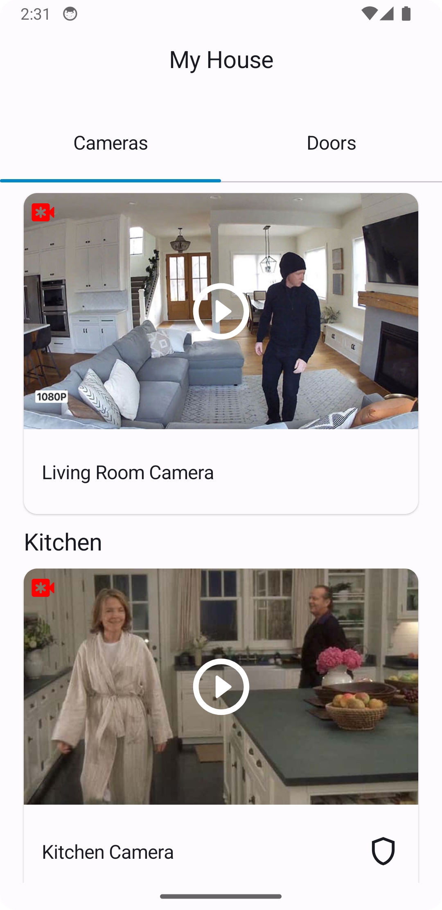
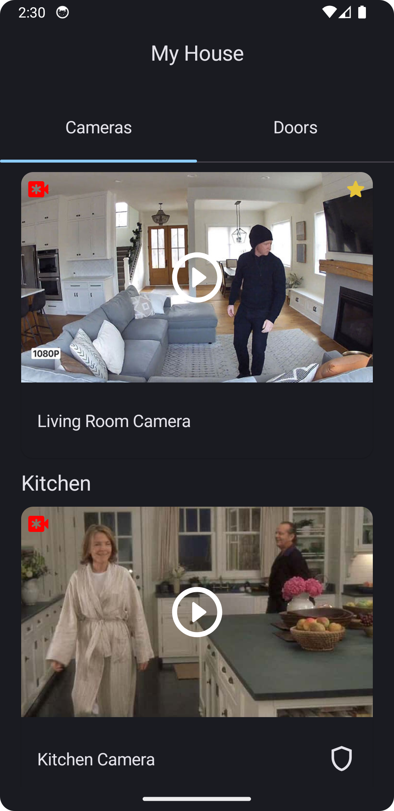
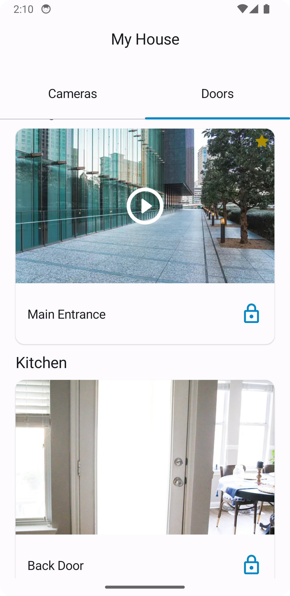
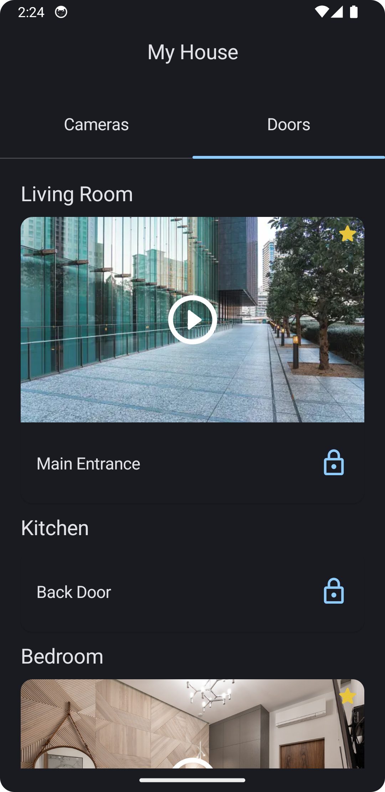
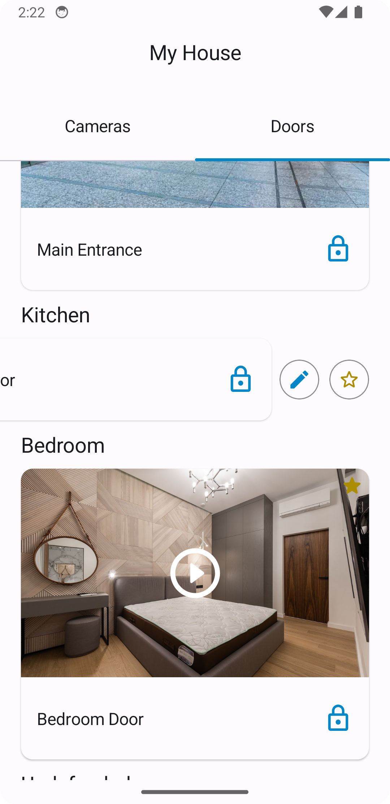
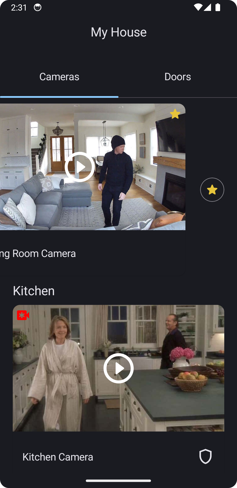

# My House

My House is a test project that provides a real-time camera and door viewing application.

## Description

My House allows users to view cameras and doors in real-time. Users can add cameras and doors to favorites, as well as rename doors for easier identification. The app supports two localizations (Russian and English) and a dark theme.

## Features

- Adding cameras and doors to favorites.
- Renaming doors for better identification.
- Localization support for Russian and English languages.
- Light and dark theme support.
- Caching of request results for enhanced performance.

## Screenshots

### Camera List Screen

Light Theme            |  Dark Theme
:-------------------------:|:-------------------------:
  |  

### Door List Screen

Light Theme            |  Dark Theme
:-------------------------:|:-------------------------:
  |  

### Edit mode

Light Theme            |  Dark Theme
:-------------------------:|:-------------------------:
  |  

## Technology Stack

- Kotlin
- Jetpack Compose
- Hilt (Dependency Injection)
- Flow (Asynchronous programming)
- Coroutine (Concurrent programming)
- Material Design
- Realm (Local database)
- Ktor (Network requests)

## Installation

1. Clone the repository: `git clone https://github.com/Nurattin/MyHouse.git`

## Usage

1. Run the app on your device or emulator.
2. Add and rename doors as desired.

---
